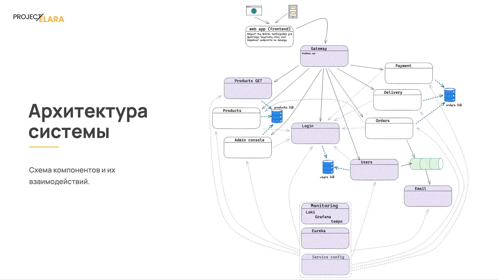
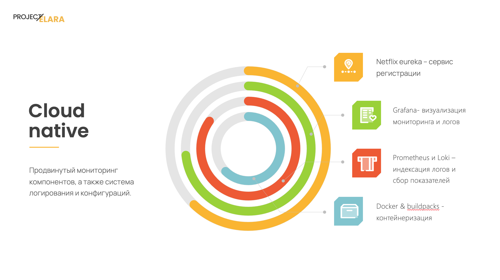

# Project Elara: e-commerce platform

This repo contains backend part of application.

## Description

Project Elara is a shoe e-shop, that allows you to buy sneakers with delivery.

<!-- pictures from presentation (intro) -->

 

## Run

1. Dowload source code or clone git repo.
2. Run individual modules with local-dev profile on spring boot application.
3. In root directory run command: `docker compose up` (you need access to conig repo)
   
## Documentation

REST API documenation you can find in [folder](openapi/api-docs/), it can be visualized using Swagger Editor.

Java doc: [site]([docs/index.html](https://germandilio.github.io/project-elara/))

## Architecture

The application is built around client-server architecture and microservices design. The main goal is to achieve high scalability and observability of the system.

<!-- pictures from presentation (arch) -->

 

## Stack

Libs & frameworks:
Spring Boot, Spring Cloud, JJWT, Lombok, Mapstruct, GSON, log4j

Tools:
Docker, Eureka, ActiveMQ Artemis, Ribbon, Postgres, Grafana, Prometheus, Loke, Tempo

## Authors:
[German](https://github.com/germandilio)

[Dmitry](https://github.com/lemon-doge)

[Mikhail](https://github.com/Michaelkh20)
